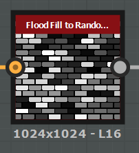

# Substance Designer Brick Tutorial

Here's what the final product will look like, with bump, normal, and glossiness maps. This is a 21 step tutorial.

### Brick Pattern and Random Color

1. In the Library window on the left hand side of the screen, search for "Brick Generator", and drag it into the Graph, or center, window. 

   - In the Parameters window on the right hand side of the screen, make these changes:
     - **Bricks** X: 8, Y: 18
     - **Beve**l X and Y: 0.4
     - **Round Corners**: 0.75

   

2. Search for "Anisotropic Blur Grayscale" Make sure you select the **Grayscale** one

   - Set the following parameters:
     - **Intensity**: 0.75
     - **Anisotropy**: 0.0
   - Connect the  **right** node of the *Brick Generator* to the **left** node of the *Anisotropic Blur Grayscale* to link them

   

3. Search for "Flood Fill"

   - Connect the node to the Anisotropic Blur Grayscale node

   
   

4. Search for "Flood Fill to Random Grayscale"

   - Connect the node to the *Flood Fill* node

   

5. Search for "Gradient Map"

   - Set the following parameters:
     - **Position**: 0.000
       - \#ffdab683
     - **Position**: 0.7
       - \#fffddfb3
   - Connect the node to the *Flood Fill to Random Grayscale* node

   

6. Search for "Anisotropic Blur" NOT Grayscale, since we're using color

   - Set the following parameters:
     - **Intensity**: 1.5
     - **Anisotropy**: 0.5
   - Connect the node to the *Gradient Map* node

   

### Brick Noise

7. Search for "Directional Noise 2", to create the vertical noise pattern for the brick seen around Campus

   - Set the following parameters:
     - **Scale**: 2
     - **Angle Degrees**: 90
     - **Angle Random**: 0.05
   - We are going to start a new node link connection, so this node will not be connected to anything.

   

   

8. Search for "Gradient Map", or select the other Gradient map we created earlier and duplicate it with Ctrl-D

   - This will decrease the strength of the noise pattern. There's other ways to do this, but this gives us more control of the specific range of values.

   - Set the following parameters:
     - **Color Mode:** Grayscale
     - **Position**: 0.000
       - \#ff848484
     - **Position**: 1.000
       - \#ffffffff

   - Connect the node to the *Directional Noise 2* node

   

9. Search for "Blend"

   - Set the following parameters:
     - **Blending Mode**: Min (Darken)
   - Connect the **middle** (Background) node to the *Gradient Map* node
   - Connect the **top** (Foreground) node to the *Anisotropic Blur Grayscale* node (second node connected to the Brick Generator)

   

10. Search for "Gradient Map"

   - Do not change the gradient, to keep it from black to white
   - Set the following parameters:
     - **Color Mode**: Color
   - Connect the node to the *Blend* node

   

### Combining Brick Color and Noise

11. Search for "Blend", or duplicate the other Blend node

    - Set the following parameters:
      - **Blending Mode**: Multiply
    - Connect the **middle** (Background) node to the *Gradient Map* node (for the brick texture)
    - Connect the **top** (Foreground) node to the *Anisotropic Blur * node (for the brick color)

    

    

### Grout

12. Search for "Invert Grayscale", and drag it near the parent (Brick Generator) node

    - Connect the node to the *Anisotropic Blur Grayscale* node

    

13. Search for "Moisture Noise", and drag it underneath the Invert Grayscale node

    - Set the following parameters:
      - **Scale**: 8
      - **Disorder**: 1

    

14. Search for "Gradient Map", or duplicate one of the others

    - Set the following parameters:
      - **Color Mode:** Grayscale
      - **Position**: 0.000
        - \#ff747474
      - **Position**: 1.000
        - \#ffffffff
    - Connect the node to the *Moisture Noise* node

    

15. Search for "Blend", or duplicate one of the others

    - Set the following parameters:
      - **Blending Mode**: Multiply
    - Connect the **top** (Foreground) node to the *Invert Grayscale* node
    - Connect the **middle** (Background) node to the *Gradient Map* node

    

    

### Combining Grout and Brick

16. Search for "Gradient Map", and put it underneath the Blend node where we combined the brick color and the brick noise

    - Set the following parameters:
      - **Color Mode:** Color
      - **Position**: 0.000
        - \#ff000000
      - **Position**: 0.655
        - \#ffdac4b0
      - **Position**: 1.000
        - \#ff9e8b79
    - Connect the node to the *Blend* node for the grout below

    

17. Search for "Blend",  and put it next to the Gradient Map

    - Set the following parameters:
      - **Blending Mode**: Max (Lighten)
    - Connect the **top** (Foreground) node to the *Blend* node for the Brick
    - Connect the **middle** (Background) node to the *Gradient Map* node for the Grout
    - Connect the node to the *Diffuse* output node on the right

    
    

### Brick Glossiness

18. Search for "Gradient Map", and put it next to the Blend node towards the bottom for the Grout noise

    - Set the following parameters:
      - **Color Mode**: Grayscale
      - **Position**: 0.335
        - \#ff7a7a7a
      - **Position**: 1.000
        - \#ff656565
    - Connect it to the *Blend* node

    

19. Search for "Grayscale Conversion"

    - Connect it to the *Gradient Map* node for the brick noise texture

    

20. Search for "Blend", and put it between the Grayscale Conversion and the Gradient Map node
    - Set the following parameters:
      - **Blending Mode**: Max (Lighten)
    - Connect the **top** (Foreground) node to the *Grayscale Conversion* node
    - Connect the **middle** (Background) node to the *Gradient Map* node
    - Connect the node to the *Glossiness* output node on the right

   

### Brick Normal

21. Search for "Height to Normal World Units"

    - Set the following parameters:
      - **Surface Size**: 300
      - **Height Depth**: 32
      - **Normal Format:** OpenGL
    - Connect the node to the *Blend* node
    - Connect the node to the *Normal* output node

    

### Final Node Graph

